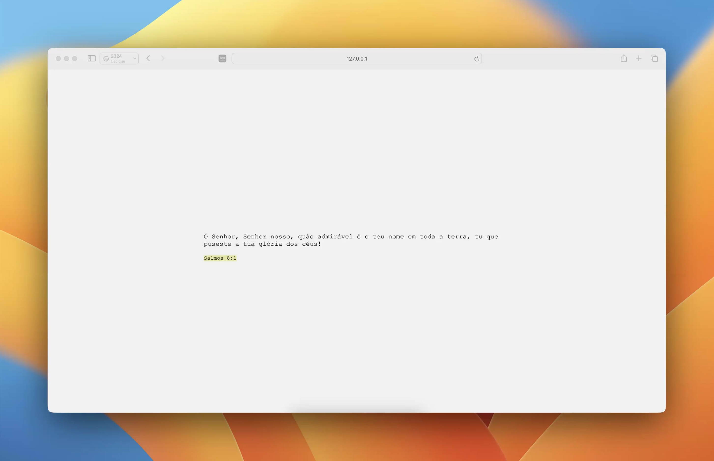

# Consumo de API com fetch

Esta Prova de Conceito mostra como utilizar o método fetch do javascript para consumo de APIs.
Para isso, foi utilizada a API: [Bible API](https://bible-api.com), que permite buscar versículos específicos da bíblia ou um versículo aleatório.

## Funcionamento básico da API

Para o consumo de dados da API é necessário construir uma url com base na documentação da api. Neste caso, usou-se o seguinte endpoint:

```https://bible-api.com/?random=verse```

A ele foi adicionada ainda a propriedade que indica qual a tradução da bíblia desejada. A função recebe este valor como argumento e repassa para a o endpoint como parâmetro da requisição:

```https://bible-api.com/?random=verse&translation=${translation}```

A resposta dessa requisição contém um objeto json na seguinte formatação:

``` json
{
    "reference":"Salmos 84:6",
    "verses":[
        {
            "book_id":"PSA",
            "book_name":"Salmos",
            "chapter":84,
            "verse":6,
            "text":"Passando pelo vale de Baca, fazem dele um lugar de fontes; e a primeira chuva o cobre de bênçãos.   "
        }
    ],
    "text":"Passando pelo vale de Baca, fazem dele um lugar de fontes; e a primeira chuva o cobre de bênçãos.   ",
    "translation_id":"almeida",
    "translation_name":"João Ferreira de Almeida",
    "translation_note":"Public Domain"
}
```

### Fetch

Foi criada uma função que busca um versículo aleatório ```getRandomVerse```, como apresentada a seguir:

``` javascript
async function getRandomVerse(translation){
    let data = {}
    try {
        let url = `https://bible-api.com/?random=verse&translation=${translation}`
        let response = await fetch(url)
        data = await response.json()
    } catch(error) {
        console.log(error)
    }
    return data
}
```

No javascript, o ```fetch```é o método utilizado para buscar dados de uma página ou arquivo de forma assíncrona. Ele recebe a url desejada (como a do exemplo acima) e faz uma requisição. A resposta dessa requisição segue o protocolo HTTP e pode ser interpretada pelo código principal.

É importante ressaltar que o fetch é um método **assíncrono**, o que significa que ele busca a requisição em paralelo à execução do restante do código principal. Portanto é necessário tratar o seu retorno, sabendo que a requisição pode ou não ser bem sucedida.

A sintaxe do ```fetch``` é bastante simples:

``` javascript
let url = `https://bible-api.com/?random=verse&translation=${translation}`
let response = await fetch(url)
data = await response.json()
```

Veja que construímos a URL de acordo com a documentação da API e a passamos como parâmetro para o método ```fetch```. Caso necessário, é possível ainda passar um segundo parâmetro que é um objeto com as propriedades adicionais. Por padrão, o método é o GET e não há nenhuma outra propriedade adicional.

Note a necessidade da palavra reservada ```await``` para indicar que é necessário esperar a solução do método para continuar a execução do código.

Por fim, conformamos o corpo desta resposta ao padrão JSON usando o método ```json()```que também é assíncrono e, por isso deve ser precedido da palavra ```await```também.

## Resultado visual
O código presente neste repositório, quando executado em um navegador apresenta o versículo no centro da página, como mostra a imagem a seguir:

